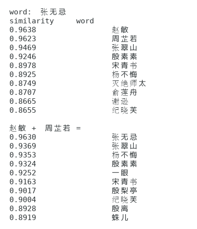

### Word2vec

word2vec是NLP一大利器，用它我们可以做很多事情，比如说近义词，关系挖掘，迁徙学习等。

为了帮助大家更好的理解word2vec，用深度学习框架实现了几个主要的模型：
* CBOW naive softmax, CBOW negative_sampling
* Skipgram naive softmax, Skipgram negative_samping

考虑到大家可能会使用不同的深度学习框架，在这里我主要使用了两种框架：
* pytorch
* tensorflow

声明： 代码仅供学习，谨慎用于实际项目中，实际项目中推荐使用成熟的解决方案：
* gensim word2vec
* word2vec 

### Result

### Recommed
* [Distributed Representations of Words and Phrases and their Compositionality](https://arxiv.org/abs/1310.4546)
* [word2vec Parameter Learning Explained](https://arxiv.org/abs/1411.2738)
* [word2vec中的数学原理](http://blog.csdn.net/itplus/article/details/37969519)

### Reference
部分代码借鉴了：
* [CBOW_on_TensorFlow](https://github.com/edugp/CBOW_on_TensorFlow/blob/master/CBOW.ipynb)
* [Skip-gram with naiive softmax](https://nbviewer.jupyter.org/github/DSKSD/DeepNLP-models-Pytorch/blob/master/notebooks/01.Skip-gram-Naive-Softmax.ipynb)
